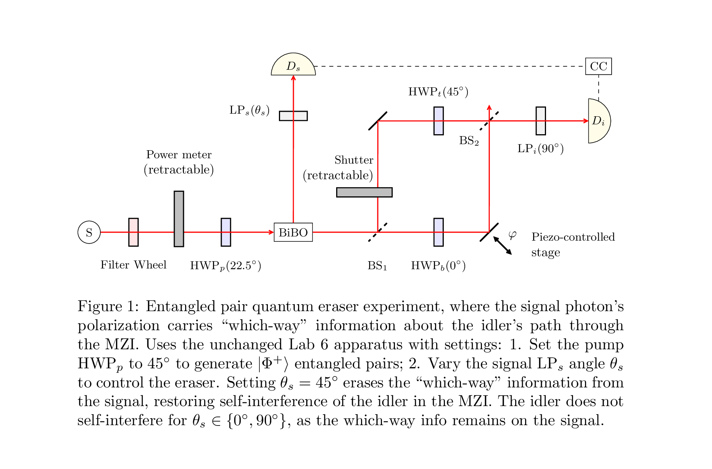

# Entangled pair quantum eraser

This repository contains a lightweight SymPy toolkit that models a
Mach–Zehnder–based entangled pair quantum-eraser experiment.

## Docs

- [Description of the experiment, relevant theory](render/lab-6-entangled.pdf) 
- [Results showing the quantum eraser working](render/2025-06-02-visibility.pdf). These results show that erasing which-way information from the signal photon (by changing the signal linear polarizer angle) controls self-interference of the idler in the MZI.
- [Results showing that the eraser is a post-selection effect](render/2025-06-15-visibility.pdf). 
These results show that the idler singles counts
don't change with the eraser on/off setting. 
Only the coincidence counts interference fringe changes
when the eraser is turned on or off.
This confirms that the
coincidences interference fringe is purely a post-selection effect.
These results were from a 5 hour automated run where the apparatus recorded 
113M single photon detections across over 50 periods of interference fringes.

## SymPy model of experiment as quantum operator

- [Symbolic model of the apparatus](lab6entangled.py) as a quantum operator.
- Includes a function to apply the operator to an initial state vector (|Phi+>, |VV>, etc) with given angle settings (signal LPs, idler LPi, MZI HWP).
- Computes the symbolic formula for expected coincidence counts versus phase delay, and expected visibility.

## Utilities

- [plot_heatmap.py](plot_heatmap.py) 
  - Draws visibility heat-maps to visualize the sensitivity of
    interference visibility to misalignments of the three experimental
    angles (signal LPs, idler LPi, MZI HWP).
  - Uses the symbolic model of the experiment, computes visibility from the formula for expected coincidence counts versus phase delay.
  - Plots heatmaps showing variation in visibility as function of angle error.
  - See [visibility_heatmaps_combined.pdf](visibility_heatmaps_combined.pdf)
- [plot_utils.py](plot_utils.py)   
  - Utilities for plotting signal, idler and coincidence counts from experimental data, 
  fitting counts to best-fit curve, computing visibility.
- [plots.py](plots.py) 
  - Parses experimental data and creates plots for signal, idler, coincidence data.
- [coincidences.py](coincidences.py)
  - Parses experimental data and creates plots for coincidence data only.

