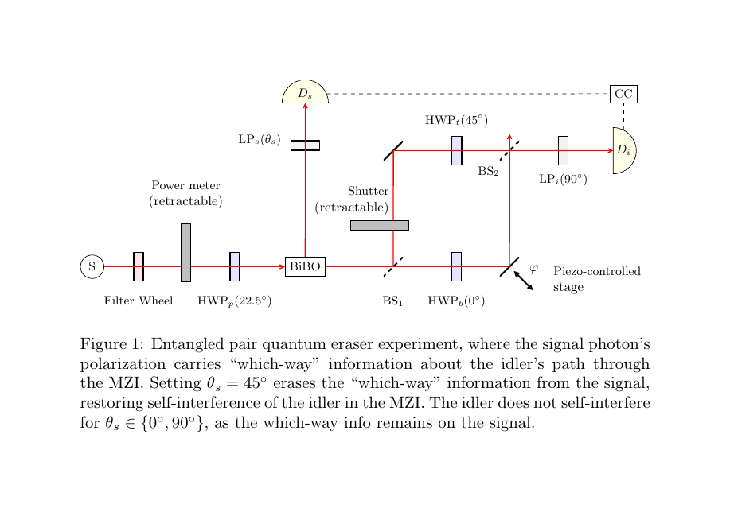

# Entangled pair quantum eraser

This repository contains a lightweight SymPy toolkit that models a
Mach–Zehnder–based entangled pair quantum-eraser experiment.

- [lab6entangled.py](lab6entangled.py) 
  - Symbolic model of the apparatus as a quantum operator.
  - Function to apply the operator to an initial state vector (|Phi+>, |VV>, etc) and obtain the symbolic formula for expected coincidence counts versus phase delay.
- [plot_heatmap.py](plot_heatmap.py) 
  - Draws visibility heat-maps to visualize the sensitivity of
    interference visibility to misalignments of the three experimental
    angles (signal LPs, idler LPi, MZI HWP).
  - Uses the symbolic model of the experiment, computes visibility from the formula for expected coincidence counts versus phase delay.
  - Plots heatmaps showing variation in visibility as function of angle error.
  - See [visibility_heatmaps_combined.pdf](visibility_heatmaps_combined.pdf)
- [plot_utils.py](plot_utils.py)   
  - Utilities for plotting signal, idler and coincidence counts from experimental data, 
  fitting counts to best-fit curve, computing visibility.
- [plots.py](plots.py) 
  - Parses experimental data and creates plots. 
- [lab-6-entangled.pdf](render/lab-6-entangled.pdf) 
  - Explains the theory, derivations and experimental procedure.
- [Results](render/2025-05-29-visibility.pdf) where erasing which-way information marked on the signal photon (by changing the signal linear polarizer angle) controls self-interference of the idler in the MZI.

| **Condition** | **Signal LP angle** | **Visibility (V)** |
|:--------------|:-------------------:|:------------------:|
| Eraser On     |   $`22.5^\circ`$    |       0.481        |
| Eraser Off    |   $`-22.5^\circ`$   |       0.055        |

Observed visibilities for idler self-interference in the MZI, when
erasing which-way information from the signal photon (or not) in the
entangled quantum eraser experiment.

<figure>
<embed src="coincidence_counts_eraser_on.pdf" style="width:60.0%" />
<figcaption> Erasing which-way information from the signal photons
produced high visibility (<em>V</em> = 0.481) self-interference of the
idlers in the MZI. Coincidence counts vs Phase Delay with the eraser on.
</figcaption>
</figure>

<figure>
<embed src="coincidence_counts_eraser_off.pdf" style="width:60.0%" />
<figcaption> Not erasing which-way information from the signal photons
prevented self-interference of the idlers in the MZI, resulting in low
visibility (<em>V</em> = 0.055).
Coincidence counts vs Phase Delay with the eraser off. </figcaption>
</figure>
